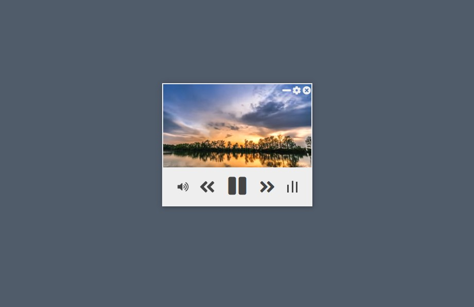

# YouTube Radio

### YouTube をコンパクトなウィンドウで再生します

# Screenshot



# Installation

npmとgitを使ってインストールします。

```
git clone https://github.com/oonishi-daijiro/YouTubeRadio
```

```
npm install
```

```
npx electron-builder
```

```
./dist 内のインストーラーを実行することでインストールできます
```
